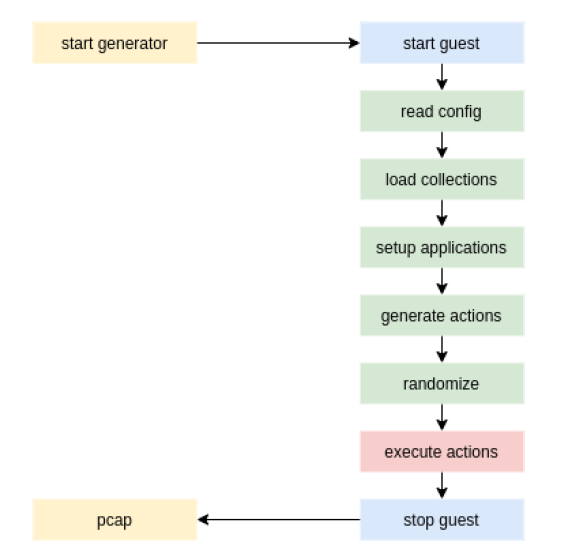

.. _gen:

****************************
Generator and manual testing
****************************

The generator is an addition to make the use of fortrace more user-friendly. It allows a user to hide one or multiple
needles in a haystack without needing to write a python script every time the framework is used. Additionally, after finishing
the scenario entered, the generator returns a.*pcap* file for the user to evaluate the generated traffic.

To use the generator, the user needs to configure a .*yaml* file (a template can be seen at the end of this section).
The file is structured in 4 section:

1. **collections**: This section contains a list of possible parameters such as email recipients, messages or lists of websites. The choice of what parameters are used is randomized and dependent on what seed is used - using the same seed twice should result in similar (or the same) results.

2. **applications**: This section determines which applications are used to generate traffic and execute the actions defined in the following sections.

3. **hay** and 4. **needles**: These sections define the actions that are supposed to be simulated to generate traffic. The separation between hay and needles is simply a formatting choice - it should have no bearing on what actions are allowed to be executed.

    Generator workflow.

The generator can be started with the following command:

.. code-block:: console

    $ python -m fortrace.generator config.yml

What follows is depicted in the workflow diagram above. First, the virtual machine(s) is started and a connection between
host and guest is established. Then, the **config.yml** is read and the collections are loaded into the generator.
Next, the needed applications are set up and **hay** and **needles** are used to generate the actions detailed in the config file.
Before executing these actions, the parameters are chosen randomly. Once all actions have completed, the guest components
are stopped and a .*pcap* file is created on the host machine.

If you are currently not using a NFS or your NFS server is not located on your host machine, leave the fields **host_nfs_path**
and **guest_nfs_path** empty - this will allow you to use normal windows or linux paths.

============================
YAML-Template
============================

.. code-block:: xml

    name: haystack-example
    description: A example action suite to generate a haystack (traffic)
    author: MPSE Group
    seed: 1234
    collections:
        c-http-0:
            type: http
            urls: ./generator/friendly_urls.txt
        c-mail-0:
            type: mail
            recipients: ./generator/friendly_recipients.txt
            subjects: ./generator/friendly_subjects.txt
            messages: ./generator/friendly_messages.txt
        c-print-0:
            type: printer
            files: ./generator/printer_default_documents.txt
        c-smb-0:
            type: smb
            files: ./generator/general_default_attachments.txt
    settings:
        host_nfs_path: /data/fortrace_data
        guest_nfs_path: Z:\\
    applications:
        mail-0:
            type: mail
            imap_hostname: imap.web.de
            smtp_hostname: smtp.web.de
            email: fortrace@web.de
            password: Vo@iLmx48Qv8m%y
            username: fortrace
            full_name: Heinz fortrace
            socket_type: 3
            socket_type_smtp: 2
            auth_method_smtp: 3
        mail-1:
            type: mail
            imap_hostname: 192.168.103.123
            smtp_hostname: 192.168.103.123
            email: sk@fortrace.local
            password: fortrace
            username: sk
            full_name: Heinz fortrace
            socket_type: 0
            socket_type_smtp: 0
            auth_method_smtp: 3
        printer-0:
            type: printer
            hostname: http://192.168.103.123:631/ipp/print/name
        smb-0:
            type: smb
            username: service
            password: fortrace
            destination: \\192.168.103.123\sambashare
    hay:
        h-http-0:
            application: http
            url: https://dasec.h-da.de/
            amount: 1
        h-http-1:
            application: http
            amount: 3
            collection: c-http-0
        h-mail-0:
            application: mail-1
            recipient: sk@fortrace.local
            subject: a random mail
            message: I’m sending you this mail because of X.
            attachments:
                - /data/fortrace_data/blue.jpg
                - /data/fortrace_data/document.pdf
            amount: 1
        h-mail-1:
            application: mail-1
            amount: 2
            recipient: sk@fortrace.local
            collection: c-mail-0
    needles:
        n-printer-0:
            application: printer-0
            file: C:\Users\fortrace\Documents\top_secret.txt
            amount: 2
        n-mail-0:
            application: mail-1
            recipient: sk@fortrace.local
            subject: a suspicious mail
            content: I've attached said document.
            attachments:
                - /data/fortrace_data/hda_master.pdf
            amount: 1
        n-smb-0:
            application: smb-0
            amount: 1
            files:
                - C:\Users\fortrace\Documents\top_secret.txt
                - C:\Users\fortrace\Documents\hda_master.pdf

=================================
Manual Testing
=================================

It is also possible to manually test single or multiple modules using self-written python
scripts. While running large scale scenarios like this may be cumbersome, it is an easy method to test
single scenarios or new modules. This section will describe the possible structure of such a script
using one of the example scripts found in **/examples/obsolete_legacy**.

First, define the details of the virtual machine that is going to simulate the guest system.
The current test scripts use a function **create_vm** for this.

.. code-block::python

    def create_vm(logger):
    # virtual_machine_monitor1 = Vmm(logger, linux_template='linux_template')
        macsInUse = []
        guests = []
        guestListener = GuestListener(guests, logger)
        virtual_machine_monitor1 = Vmm(macsInUse, guests, logger)
    # guest = virtual_machine_monitor1.create_guest(guest_name="l-guest01", platform="linux", boottime=None)
        guest = virtual_machine_monitor1.create_guest(guest_name="w-guest01", platform="windows", boottime=None)
        logger.debug("Try connecting to guest")

        while guest.state != "connected":
            logger.debug(".")
            time.sleep(1)

        logger.debug(guest.guestname + " is connected!")

        return guest

Here, the name of the guest and its operating system are determined. Then, after cloning the template and starting the guest
a connection is established.

In the **main** portion of the script, the function is called before executing the application that the user wants to run.

.. code-block::python

        browser_obj = None
        browser_obj = guest.application("webBrowserFirefox", {'webBrowser': "firefox"})
        browser_obj.open(url="faz.net")
        while browser_obj.is_busy:
		time.sleep(2)
        browser_obj.browse_to("heise.de")
        while browser_obj.is_busy:
		time.sleep(2)
        browser_obj.browse_to("google.de")
        while browser_obj.is_busy:
                time.sleep(2)
        browser_obj.browse_to("bild.de")
        while browser_obj.is_busy:
                time.sleep(2)
	time.sleep(10)
        browser_obj.close()
	while browser_obj.is_busy:
		time.sleep(5)

        time.sleep(5)
        guest.remove()

In this example, an instance of the Firefox application is started and directed to open a browser, browse to 3 different websites
and then close the browser. In the end, the guest system is shut down and deleted. If you want to keep a system intact, simply
remove the final line (**guest.remove**).

It would also be advisable to add some exception handling to your script. An example is shown below.

.. code-block::python

    ######## CLEANUP ############# ERROR HANDLING
    except KeyboardInterrupt as k:
        logger.debug(k)
        logger.debug("KeyboardInterrupt")
        logger.debug(k)
        logger.debug(virtual_machine_monitor1)
        raw_input("Press Enter to continue...")
        virtual_machine_monitor1.clear()
        logger.debug("cleanup here")
        try:
            virtual_machine_monitor1.clear()
        except NameError:
            logger.debug("well, host1 was not defined!")

        exit(0)

    except Exception as e:
        logger.debug("main gets the error: " + str(e))
        logger.debug("cleanup here")
        raw_input("Press Enter to continue...")
        try:
            virtual_machine_monitor1.clear()
            subprocess.call(["/etc/init.d/libvirt-bin", "restart"])
        except NameError:
            logger.debug("well, host1 was not defined!")
        sys.exit(1)

The script is then called like any other python script.

.. code-block::cmd

    $ python testrun3.py