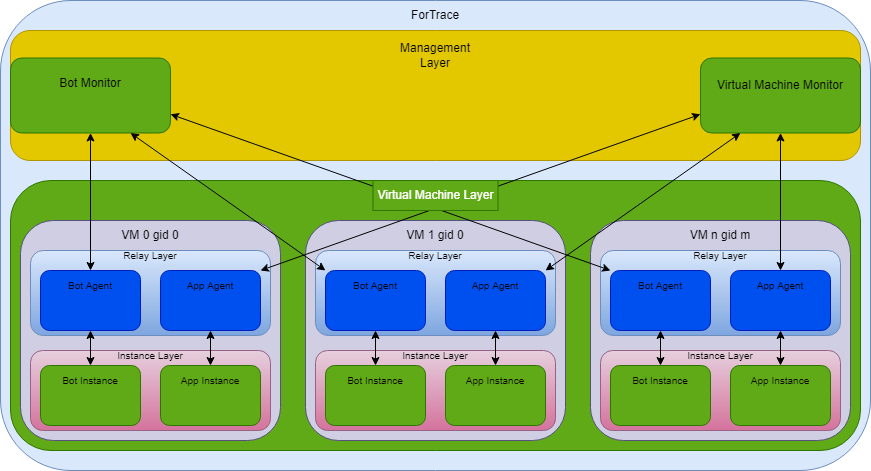
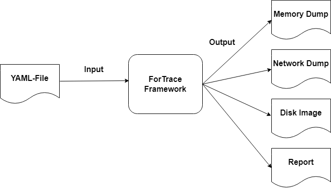

.. _architecture_index:

======================
Architecture of ForTrace
======================

In this part we shed some light on the architecture of ForTrace. We will explain which tools are used by the
framework, for example how virtualization is achieved, how  it synthesizes forensic artifacts and other important aspects.
However most importantly we will clarify the different parts of the framework and their interaction to make the installation process more transparent.

First it is important to understand that ForTrace consists of two distinct parts. The first being the user simulation
model that will be run on the physical machine. This part will communicate with an agent inside a virtual machine which
serves as the second part of ForTrace. Both of these need to be installed before use, as described in :ref:`installindex`.

Framework architecture
#######################

ForTrace is designed to create forensically relevant artifacts by simulating user inputs. The simulation of
these inputs are achieved by using the layered architecture seen in the image below. The host (or management layer)
creates the virtual environments specified by the active scenario. These virtual environments are clones of previously
prepared templates (see :ref:`guestinstall`). By using a network bridge created solely for the communication between the
management layer and virtual machine layer (or guest/s), function calls are fed from the host to the the guest machine,
executing the data synthesis scenario created and executed at the beginning.

       Graphic of ForTrace's layered architecture.

For a more in-depth explanation about functions, workflow and architecture, please refer to :ref:`arch`.

Service VM
####################

The Service VM is a permanent virtual machine, that is not deleted after usage (like the cloned guest component of ForTrace can be) and provides
services to one or multiple ForTrace guest components. This allows for easier configuration of ForTrace and increases its usability.
There are currently 3 services available: A mailserver (SMTP emails - PostFix & Dovecot), printing systems (IPPServer) and a
network drive (SMB).

For a more in--depth explanation of the service VM and the services included you can refer to :ref:`service`.

An additional Service VM can be installed to enhance the malware synthesis capabilities of this framework.
Refer to :ref:`malwareservice` for further information.

Generator
####################

The Generator serves as a way to simplify the user interaction model, allowing users to create scenarios of user interactions
with both malicious and benign artifacts by feeding a YAML-file to the ForTrace generator. This allows for easy creation
and reproduction of data generation scenarios, removing the necessity of handily programmed scenarios.

        Generator workflow graphic.

For a more in-depth explanation of the generator's workflow and functionality, please refer to :ref:`gen`.

Reporter
#################

In addition to tcpdump, ForTrace has a separate built-in evaluation functionality with the **reporter**. This reporter's main
task is to display an overview of the time and type of actions taking place during a simulation. The reporter produces an .*xml*
file that can be displayed using a web viewer (**report.html**) delivered alongside the framework.
