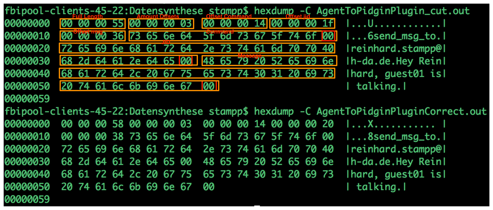

InstantMessenger
----------------

.. autoclass:: fortrace.application.instantMessenger.InstantMessengerVmmSide
   :members:

.. autoclass:: fortrace.application.instantMessenger.InstantMessengerVmmSideCommands
   :members:

.. autoclass:: fortrace.application.instantMessenger.InstantMessengerGuestSide
   :members: open, close, set_config, get_contact_list, send_msg_to

.. autoclass:: fortrace.application.instantMessenger.InstantMessengerGuestSideCommands
   :members: