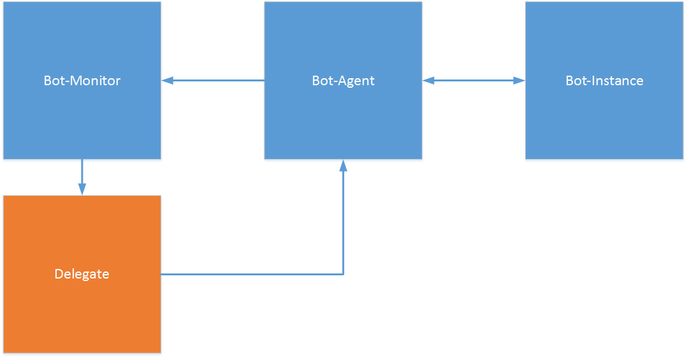

Architecture
------------

This section describes the global architecture of the botnet framework.

The botnet framework follows a simple reverse proxy model.

We have a server component (Bot-Monitor) that handles incomming connections and sends orders via delegates.

Delegates represent client connections and stores remote states.
They also allow sending commands.

The client component (Bot-Instances) itself mostly handles execution of orders but will also send state infos.

In between the server and client components sits a relay/proxy (Bot-Agent) that
watches client states, initializes clients and relays messages between client and server.

By default the server component will sit at a remote location
that is shared by the user framework's server component.
Relay/proxy and client will share the same location and form a pair per VM.
