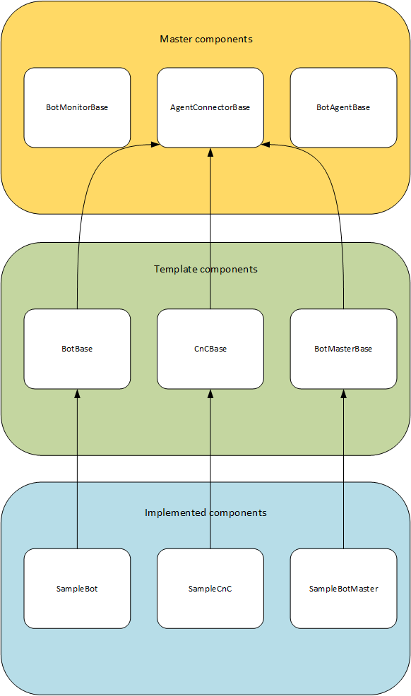

Components
----------

This section describes the individual components of the botnet framework.

We differenciate between the master components that provide the basic functionalities.

From there on the template components follow that provide interfaces for specialized usages.
This also includes the delegate interfaces.
The delegates themselves are uniform for every implementation.

At last there are the implemented components or bot-instances.

These consist of an actual implementation of the template interfaces or to be more precise the delegate triggers.

It is decided by the implementor whether the interfaces actually trigger anything.

See :ref:`extending_botnet_framework` for details.