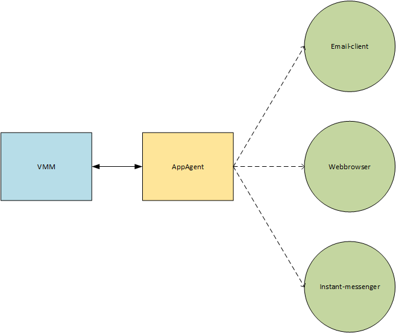

Architecture
------------

The architecture closely follows the client-server-architecture.

The server issues commands.
The client performs the given task and will initiate and control an application of a given type.
An example would be browsing the web or sending and receiving emails.
