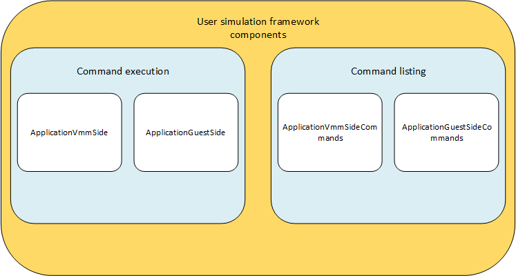

Components
----------

The user frameworks components are rougly categorized between VMM-components and Guest-components.

These consist of the classes for running a given set of commands and listing the supported commands.

See :ref:`extending_user_simulation_framework` for implementation instructions.
