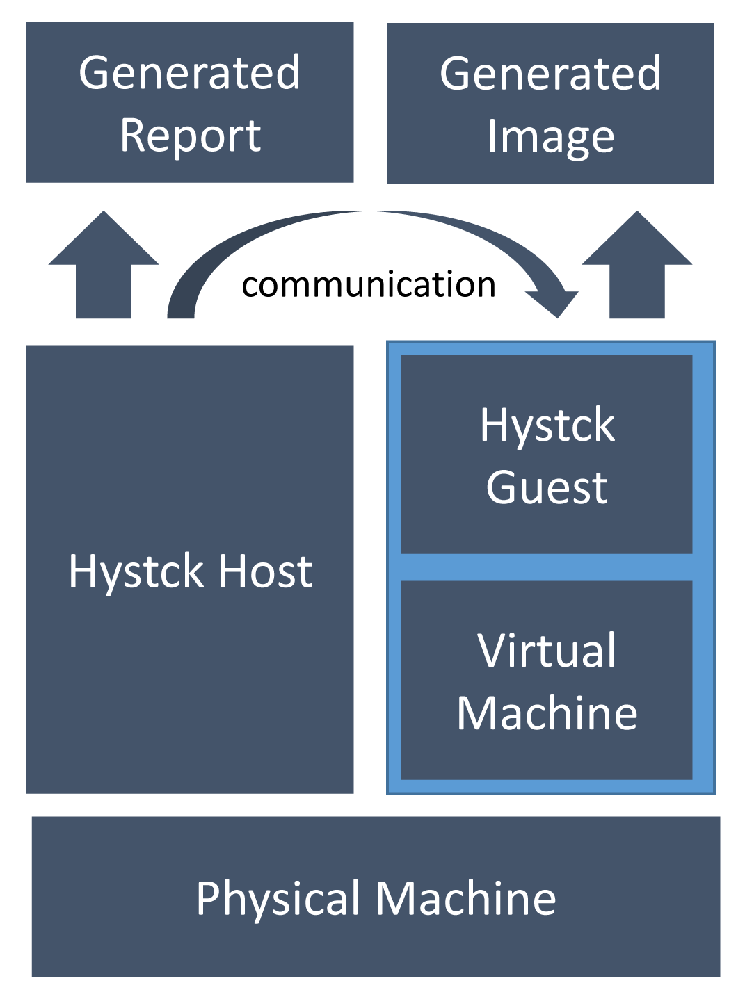

============================
General Installation Process
============================

In this section you will find information about the general minimal installation process.
For the virtualization KVM is used. If you are unfamiliar with it just look into a basic tutorial for creating and starting Virtual Machines.

Preparation
===========

There are a few steps to be considered before starting with the installation process. In the following list we will go over them one by one.

1. Host System Operating System
-------------------------------

fortrace is a program written in python. As of this it should run on most operating systems but to this day was only tested on different flavours of Linux. Because of this the documentation will only cover host setups considering Linux. We especially encourage the use of Ubuntu as fortrace was originally written and developed on an Ubuntu system.

2. Host System Requirements
-------------------------

 - This document is written at a time where the largest disks widely available are 4TB HDD and 1TB SSD and virtualization becomes more and more practical. For the most parts there won't be a problem with disk space, but depending on what you are aiming to do the generated images might extend to a multiple hundred gigabytes. You may want to have at least 30GB for the base template image and an additional 20GB for the differential images and packages needed to be installed.

 - There are also some requirements considering CPU and RAM requirements. There should be a multi-core processor to dedicate processor cores to the virtual machine of the guest system. In our tests we saw spikes in CPU usage of nearly 100% while fortrace was running. Theses tests have been run on a system with an Intel© Core™ i5-7200U Dual-Core CPU with 2.5 GHz clock rate. There should be an equal processor installed on the host system. For the RAM we have found that it depends on the settings of the virtual machine. The more RAM is dedicated to it the more RAM needs to be installed on the physical system. In our tests we had a system with 8 GB of RAM with 2.5 GB dedicated to the virtual machine. This allowed for a smooth working process while allocating roughly 80% of the installed RAM. This means a setup for a good working environment should at least hit these requirements.

Requirements:

+---------+---------------------------------------------------+
| Hardware| Requirement                                       |
+=========+===================================================+
| RAM     | 8 GB                                              |
+---------+---------------------------------------------------+
| CPU     | Intel© Core™ i5-7200U Dual-Core CPU or equivalent |
+---------+---------------------------------------------------+
| DISK    | at least 50 GB                                    |
+---------+---------------------------------------------------+

3. Host System Install
----------------------

For this you should work your way through the requirements section of the host documentation.
After that you need to obtain the sourcecode. When you have the sourcecode there should be a ``setup.py`` in the root folder of the repository. Execute this by running ``$ python setup.py install``. Bear in mind that you might have to setup a python alias as described in the requirements. After this step was successful your host installation is done. Maybe some additional troubleshooting is required depending on the used Linux distribution. Bear in mind that the host system will be installed directly on the physical machine, not in a virtual machine.

4. Guest System Operating System
---------------------------------

In most cases this would be some sort of Windows OS as it still is the most used operating system on Laptop and Desktop environments. If unsure Windows 7 is the most tested OS in the fortrace framework and fairly easy to set up.
Here you can go ahead and download the .iso file presented by Microsoft and just follow the installation process.
Additionally please install Mozillas Firefox, this step is important to test your installation later on.
After that please work your way through the guest installation process.
Don't forget to do the ``setup.py`` part on the guest system as well.

5. Testing Installation
-----------------------

To test if everything is working correctly please run the ``examples/basic_install_test.py``. This script will start the Virtual Machine, open Firefox and browse to a website then close the Virtual Machine. You can verify this by starting up the generated Virtual Machine (will be named tbtest). If the browser opens, shows a website and closes your installation was successful.