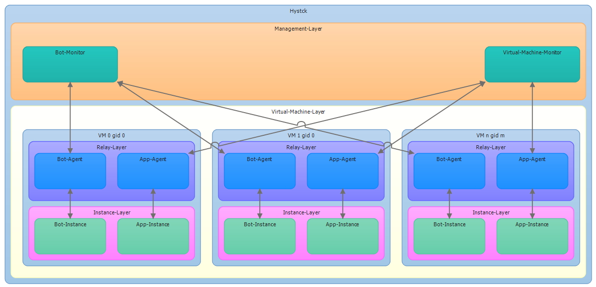

===============
What is fortrace?
===============

fortrace is an open source benign network traffic generator.

Some History
============

fortrace started as a master thesis by Reinhard Stampp in 2013.

Use Cases
=========

fortrace is designed to create network traffic for the following applications:

    * Web Browser based
    * Mail Client related
    * Instant Messaging

New Applications can be easily added due to the modular design of fortrace.

Read :doc:`../../usage/addApplication` to learn how to add a application.

Architecture
============

Obtaining fortrace
================

fortrace can be downloaded from the `developer's website`_, where the stable and
packaged releases are distributed.

We will refer $fortrace as the path fortrace has been downloaded or checked out to.

